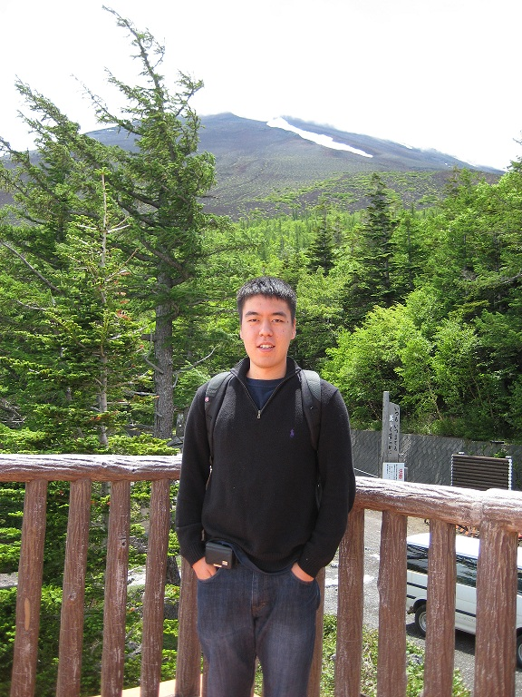

--- 
status: publish
title: About Me
meta: 
  _edit_last: "1"
layout: default
tags: []

published: true
type: page
---

I'm an currently an undergrad studying Mathematics and Linguistics at McGill University. This summer (2012), I will be working as a Software Engineer Intern at Facebook. In September, I will return to McGill to start an M.Sc. in Applied Mathematics with [Prof. J.-C. Nave](http://www.math.mcgill.ca/jcnave/).

I like to write about technical subjects. Sometimes, I digress into social and political commentary.